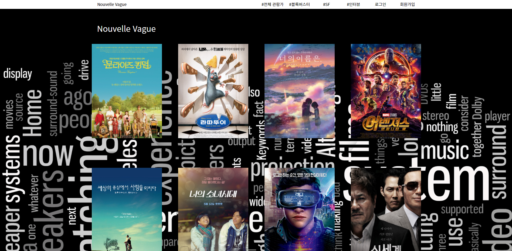
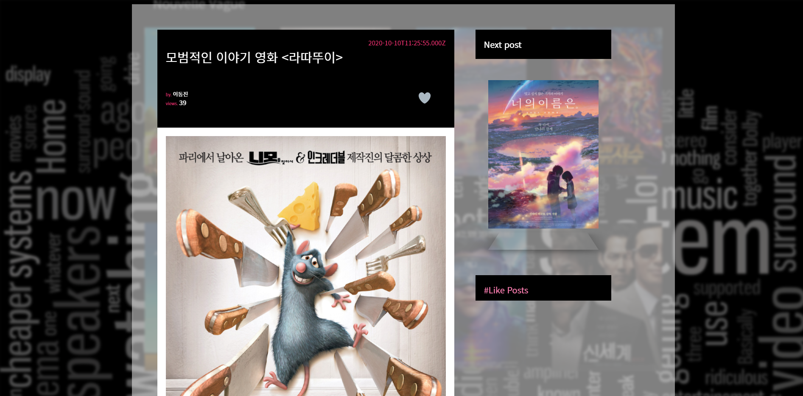
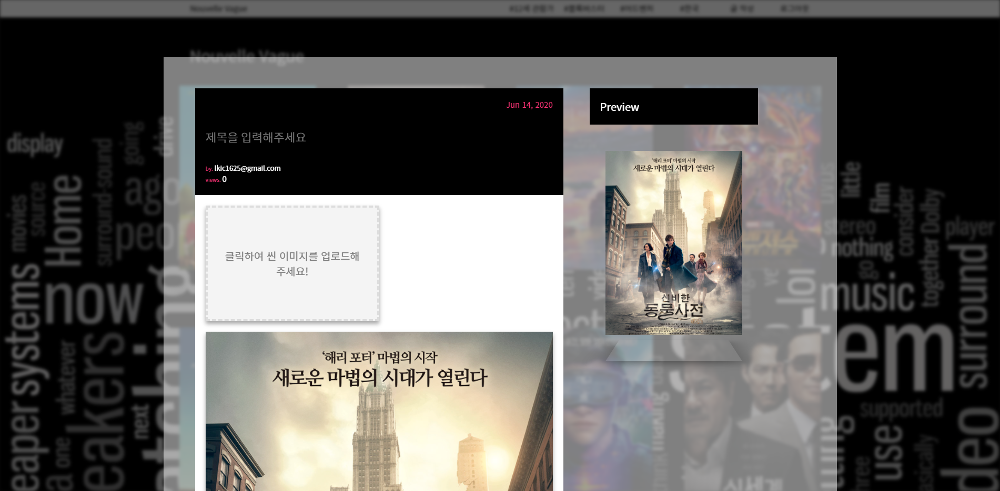

# Nouvelle-Vague
기술스택 Node.js, MySQL, html, CSS, Javascript,

## 개요

- 프로젝트 명: Nouvelle Vague
- 일정: 2018.06 (프론트), 2020.10 (백엔드)
- 목적: 누벨 바그(프랑스어: La Nouvelle Vague, 영어: New Wave)는 전 세계 영화에 큰 영향을 준 프랑스의 영화적 경향이다. 프랑수아 트뤼포를 비롯한 젊은 영화인들이 주축이 돼 펼쳐졌으며, 고전적/현대적 분기점의 영화 사조이다. (출처:https://ko.wikipedia.org/wiki/%EB%88%84%EB%B2%A8_%EB%B0%94%EA%B7%B8)  웹프로그래밍 팀 프로젝트로 진행됐으며 영화나 음악과 같은 콘텐츠 리뷰를 쉽게 작성하고 볼 수 있는 웹진을 만들기 위해 제작했습니다.
- 사용 기술
- DB: MySQL
- Framework/flatform: Nodejs, jQuery
- Programming Language: Javascript, HTML, CSS

메인입니다. 여러 포스트를 접근할 수 있습니다.

포스트를 클릭 시 화면입니다.

회원가입 이후 자신만의 웹진을 만들 수 있습니다.

또한, 태그를 통해 원하는 분야의 포스트를 골라 읽을 수 있습니다.

